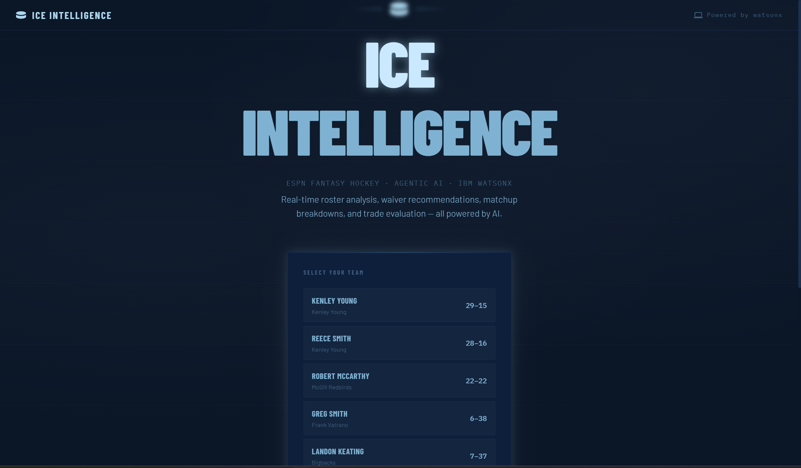
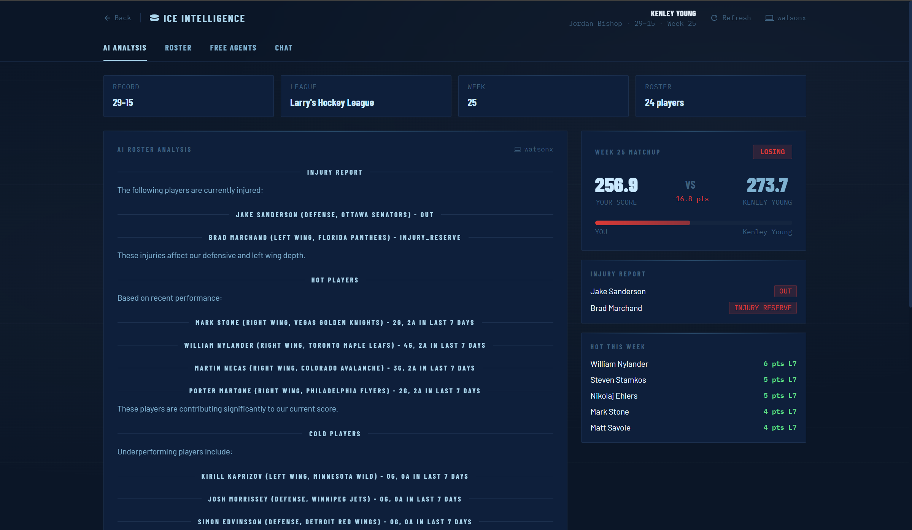

# Ice Intelligence
### ESPN Fantasy Hockey AI Agent — Powered by IBM watsonx

AI-powered fantasy hockey analytics. Real ESPN league data + IBM watsonx AI = personalized lineup advice, waiver recommendations, trade analysis, and matchup breakdowns.

Built for the **IBM SkillsBuild AI Experiential Learning Lab 2026** — Track #3: Fan-Centric Sports & Entertainment.

---

## Demo

📹 [Watch Demo Video](https://drive.google.com/file/d/1ThcykYirYRkTOLQf_2pdLCdxK43hY1Zr/view?usp=sharing)

### Screenshots




---
## Project Structure

```
ice-intelligence/
│
├── api_server.py           # FastAPI backend — bridges web UI and Python AI
├── main.py                 # Terminal CLI entry point
├── config.py               # Your credentials (not committed)
├── config.example.py       # Credential template
├── requirements.txt        # Python dependencies
│
├── espn/                   # ESPN Fantasy Hockey data layer
│   ├── league.py           # League connection, manager/team lookup
│   ├── roster.py           # Roster parsing and stat extraction
│   ├── free_agents.py      # Free agent fetching and scoring
│   └── matchups.py         # Matchup data and weekly schedule
│
├── watsonx/                # IBM watsonx AI layer
│   ├── client.py           # IBM auth and model inference
│   └── prompts.py          # All prompt templates
│
├── agent/                  # AI agent logic
│   ├── analyzer.py         # Core analysis engine
│   └── chat.py             # Terminal chat loop
│
├── utils/
│   └── formatter.py        # Terminal display helpers
│
├── logs/                   # Auto-saved session logs
│
└── web/                    # Next.js web UI
    ├── app/
    │   ├── page.tsx        # Landing page — manager selector
    │   ├── dashboard/
    │   │   └── page.tsx    # Main dashboard
    │   └── api/            # Next.js API routes → Python backend
    ├── components/
    │   ├── RosterTable.tsx
    │   ├── ChatInterface.tsx
    │   ├── MatchupCard.tsx
    │   ├── FreeAgentList.tsx
    │   └── StartupAnalysis.tsx
    ├── lib/api.ts           # Frontend API helpers
    └── types/index.ts       # TypeScript types
```

---

## Tech Stack

| Layer | Technology |
|-------|-----------|
| AI Model | IBM watsonx — `meta-llama/llama-3-3-70b-instruct` |
| Platform | IBM watsonx.ai (Dallas) |
| Fantasy Data | ESPN Fantasy Hockey API (`espn-api`) |
| Backend | Python + FastAPI |
| Frontend | Next.js 14, React, TypeScript, Tailwind CSS |
| Icons | react-icons |

---

## Setup

### 1. Install Python dependencies
```bash
pip install -r requirements.txt
```

### 2. Configure credentials
```bash
cp config.example.py config.py
```
Fill in `config.py` with your ESPN cookies, league ID, IBM API key, and project ID.

### 3. Install web dependencies
```bash
cd web
npm install
```

### 4. Run the Python API server
From the project root:
```bash
uvicorn api_server:app --reload --port 8000
```

### 5. Run the web UI
From the `web/` folder:
```bash
npm run dev
```

### 6. Open the app
Go to `http://localhost:3000`

---

## Running as terminal CLI (no web UI)
```bash
python main.py
```

---

## ESPN Cookie Setup

1. Log into ESPN Fantasy Hockey
2. Open DevTools (F12) → Application → Cookies → `https://www.espn.com`
3. Copy `espn_s2` and `SWID` values into `config.py`

---

## Features

- **AI Roster Analysis** — injury report, hot/cold streaks, schedule context
- **Free Agent Recommendations** — top pickups, hot wire, players on the rise
- **Matchup Breakdown** — current score, opponent analysis, strategy
- **Trade Evaluator** — accept/reject with category impact
- **Interactive Chat** — ask anything about your team
- **Web Dashboard** — full UI with roster table, free agents, matchup card
- **Session Logging** — every terminal session saved to `/logs`

---

## IBM watsonx Notes

- Model: `meta-llama/llama-3-3-70b-instruct`
- Region: Dallas (`us-south.ml.cloud.ibm.com`)
- Never commit `config.py` — API key is sensitive
- Never commit `web/.env.local`
